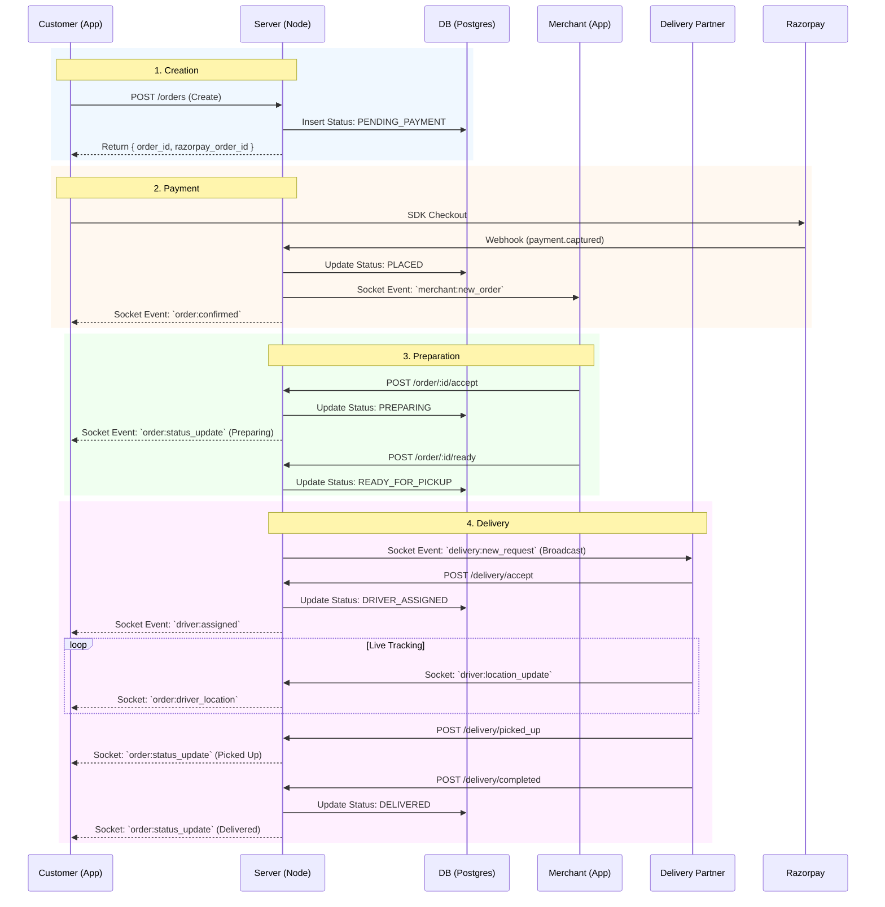

# System Architecture & Data Flow (Step 2 SSOT)

> [!IMPORTANT]
> This document follows strict **Step 1** constraints:
> - **Platform**: Android Mobile App (React Native), Delivery iOS (SwiftUI), Admin Web (React).
> - **Backend**: Node.js + Express (Modular Monolith).
> - **Real-time**: Socket.IO.
> - **Payments**: Razorpay (Server-side creation, Webhook verification).
> - **Security**: No client-side payment logic, strict RBAC.

---

## 1. Architecture Overview

 The system follows a **Modular Monolith** architecture on **Node.js**:
 - **Single Runtime**: Low latency, shared types, simplified deployment for MVP.
 - **Logical Separation**: Codebase organized into distinct domains (Services).
 - **Centralized Event Bus**: Using Node.js `EventEmitter` for internal decoupling and `Socket.IO` for external real-time updates.

### High-Level Components
1.  **Mobile Apps**:
    *   **Customer App (Android)**: React Native. Consumes REST APIs & Socket.IO.
    *   **Delivery App (iOS)**: SwiftUI. High-frequency location application.
2.  **Admin Dashboard**: React.js Web. WebSocket-connected for live monitoring.
3.  **API Gateway / Interface Layer**: Express.js middleware handling Rate Limiting, CORS, and Route dispatching.
4.  **Core Services (Modules)**:
    *   **Auth Service**: JWT management, OTP via SMS provider.
    *   **Catalog Service**: Store/Product management (Read-heavy).
    *   **Order Service**: Core state machine, pricing, inventory checks.
    *   **Payment Service**: Razorpay integration, Webhook handling, Ledger.
    *   **Delivery Service**: Driver assignment, Geo-spatial queries (PostGIS).
5.  **Infrastructure Services**:
    *   **Real-Time Service**: Socket.IO manager (Rooms, Namespaces).
    *   **Notification Service**: FCM Push Notifications.
6.  **Data Layer**:
    *   **PostgreSQL**: Primary transactional store (Relational).
    *   **Redis**: Caching (Catalog), Session/OTP storage, Socket.IO adapter.

---

## 2. Service Responsibility Boundaries

| Service | Purpose | Owned Data (DB Tables) | Public Responsibilities | Events Emitted |
| :--- | :--- | :--- | :--- | :--- |
| **Auth** | Identity & Access Management | `users`, `otps` | Login, Verified, Refresh Token | `user.registered`, `user.logged_in` |
| **Catalog** | Store & Menu Management | `stores`, `products`, `categories` | Get Stores, Get Menu, Search | `store.opened`, `store.closed` |
| **Order** | Lifecycle Management | `orders`, `order_items` | Create Order, Update Status, History | `order.created`, `order.status_changed` |
| **Payment**| Transaction Processing | `payments`, `refunds` | Verify Webhook, Get Status | `payment.success`, `payment.failed` |
| **Delivery**| Logistics & Tracking | `deliveries`, `driver_logs` | Driver Availability, Location Update | `delivery.assigned`, `driver.location` |
| **RealTime**| Live Communication | *Ephemeral* | Join Room, Broadcast Event | *N/A* |

---

## 3. Real-Time Order Flow (Mandatory)

### Diagram: Order Lifecycle


### Event Specifications
1.  **`driver:location_update`**
    *   **Pub**: Delivery App
    *   **Sub**: Server
    *   **Payload**: `{ lat, lng, bearing }`
2.  **`order:driver_location`**
    *   **Pub**: Server
    *   **Sub**: Customer App (Room: `order_{id}`)
    *   **Payload**: `{ lat, lng }`
3.  **`merchant:new_order`**
    *   **Pub**: Server
    *   **Sub**: Merchant App (Room: `merchant_{id}`)
    *   **Payload**: `{ order_id, items, timer }`

---

## 4. Payment Flow (Razorpay)

> [!CAUTION]
> **Constraint Checklist**:
> - Server-side creation? ✅
> - Webhook verification? ✅
> - No client-side logic? ✅

### 1. Order Creation
1.  Customer clicks "Checkout".
2.  App calls `POST /api/v1/orders`.
3.  Server validates inventory & calculates total.
4.  Server calls Razorpay API: `orders.create({ amount: ..., currency: "INR" })`.
5.  Server saves `razorpay_order_id` in DB `payments` table.
6.  Server returns `{ success: true, razorpay_order_id, key_id, amount }`.

### 2. Client Payment
1.  Android App opens Razorpay Native SDK with `razorpay_order_id`.
2.  User completes payment.
3.  **Client does NOT update Order status.** Client only shows "Waiting for specific confirmation".

### 3. Server Verification (The Truth)
1.  Razorpay sends Webhook: `payment.captured`.
2.  Server receives Webhook on `/api/v1/webhooks/razorpay`.
3.  Server verifies `X-Razorpay-Signature` using `HMAC-SHA256`.
4.  **If Valid**:
    *   Update `payments` table -> `SUCCESS`.
    *   Update `orders` table -> `PLACED`.
    *   Trigger `RealTimeService.notifyMerchant()`.
5.  **If Invalid**: Ignore/Log security alert.

### 4. Failure Handling
*   **Payment Failed**: Razorpay SDK handles retry UI.
*   **Network Drop**: Client polls `GET /orders/:id` to check if Webhook updated the status.

---

## 5. Auth & Security Flow

### Authentication
-   **Method**: Phone Number + OTP.
-   **Tokens**:
    -   `Access Token`: JWT (Short-lived, 15m). Contains `user_id`, `role`.
    -   `Refresh Token`: Opaque DB hash (Long-lived, 7d).
-   **Socket Auth**:
    -   Handshake query `?token=JWT`.
    -   Server validates JWT before allowing connection.

### Security Rules
1.  **RBAC Middleware**:
    -   `ensureRole('merchant')` protects `/merchant/*` routes.
2.  **Rate Limiting**:
    -   `auth/*`: Strict (5 req/min) to prevent OTP spam.
    -   `orders/*`: Moderate (10 req/min).
3.  **Data Isolation**:
    -   Merchants can ONLY view orders with their `store_id`.
    -   Drivers can ONLY view orders they have `accepted`.

---

## 6. Architecture Diagrams (Textual)

### System Data Flow
```
[Android App] <---> (HTTPS) <---> [Load Balancer / Nginx]
      |                                   |
      +-------> (WSS) ----------------> [Node.js Backend]
                                          |
                                          +--- [Auth Module] <---> [Redis (OTP/Sessions)]
                                          +--- [Order Module] <---> [PostgreSQL (Orders)]
                                          +--- [RealTime Module] <--> [Socket.IO Rooms]
                                          +--- [Payment Module] <--- (Webhook) --- [Razorpay]
```
